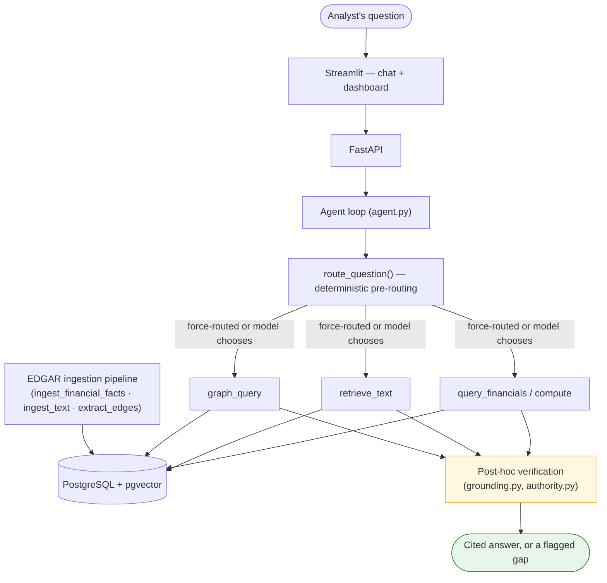
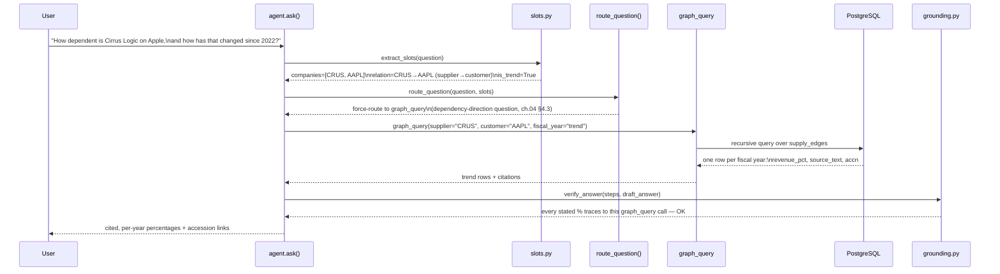

# 00 · Overview

**What you'll build**: nothing yet — this chapter is the mental model, not
a command. By the end you'll know why the system is shaped the way it is
and what happens, step by step, when a user asks it a question. Chapters
01–05 then build and verify each piece.

**Verifiable Supply-Chain Risk Copilot** — an analyst-facing agent that answers
questions over SEC 10-K filings with numbers that trace back to SQL/XBRL and
relationships that trace back to a specific disclosure sentence, for the
Apple supply-chain cluster (AAPL plus 14 suppliers/peers spanning both named
customer-concentration disclosures and diversified companies with none).

## From plain RAG to this agent — a learning map

If you already know what RAG (retrieval-augmented generation) is, this table
is the fastest way to see where this project sits and why — each row adds
exactly one capability on top of the last, and each addition exists because
the row above it was measurably insufficient:

| Step | Capability | Why it wasn't enough on its own | Chapter |
|---|---|---|---|
| 0 | **Plain RAG** — embed documents, retrieve top-k, stuff into a prompt | Numbers inside retrieved prose can't be verified against anything; the model can misread or round a figure with no way to catch it | — (the starting point, not built here) |
| 1 | **+ Tool calling** — the model can also call `query_financials`/`compute` against structured SQL data, not just read retrieved text | An agent with a tool *and* a retriever will sometimes reach for the wrong one, or misfire between similarly-worded questions | ch.04 §4.1 |
| 2 | **+ Deterministic routing** — some question shapes are classified and force-routed to the right tool *before* the model chooses, bypassing its own judgment for known-ambiguous cases | Even a well-routed agent can silently apply a real number to the wrong company, year, or unit | ch.04 §4.2–§4.3 |
| 3 | **+ A relationship graph, not just documents** — `graph_query` traverses hand-extracted, per-edge-cited supplier↔customer relationships instead of hoping they surface via retrieval | None of the above catches a model stating a plausible-looking number that no tool call ever actually produced | ch.03 §3.4, ch.04 |
| 4 | **+ Post-hoc verification** — every finished answer is checked against its own tool-call trace *after generation*, independent of how confident the answer sounds | This is close to where the system currently stands — ch.07 documents what verification still doesn't catch | ch.04 §4.5, ch.07 |

The system diagram below is Step 4: every arrow in it is something a plain
RAG pipeline does not have.

Every number the agent states comes from `query_financials`/`compute`
(SQL, never the model's own arithmetic — the project's one non-negotiable
rule). Every relationship claim comes from `graph_query` against
`supply_edges`, each row carrying the verbatim 10-K sentence it was
extracted from. A verification layer (`agent/grounding.py`,
`agent/authority.py`) checks after the fact that every number in an answer
actually traces back to a tool call, and flags what it cannot source rather
than silently trusting the model.

## Walking one question through the system

Concrete beats abstract. Here is *"How dependent is Cirrus Logic on Apple,
and how has that changed since 2022?"* traced through every layer above —
the same question this handbook's README uses as its running example, so
what you build in ch.01–05 is literally this path, not a different one.

Three things worth noticing about this trace, each expanded in ch.04:

1. **The model never chose the tool.** `route_question()` recognized this as
   a dependency-direction question and force-routed to `graph_query` before
   the model's own judgment entered the picture — the point of ch.04 §4.3.
2. **`is_trend=True` changed the query shape**, not just a formatting choice
   — "how has that changed" made `slots.py` request every year on record
   instead of the latest one alone (ch.04 §4.2).
3. **Verification ran after the answer was drafted**, checking the trace
   independently rather than trusting the model's own confidence — the
   distinction ch.04 §4.5 exists to make precise (it catches an *ungrounded*
   number; it does not, by itself, catch every way a grounded number can
   still be wrong for the question asked — ch.07 has the documented gap).

## Two lines of work, two repositories

- **Product** (this handbook covers it): `Financial-Report-Research-Copilot`
  — the agent, the eval harness, the dashboard. This handbook targets the
  `v1.0-teaching` tag: a curated rebuild of the development repo (cut
  2026-08-26), pruned of development-history residue; see the README.
- **SQLLock study**: `sqllock-grounding-study` — a separate, later controlled
  experiment asking a narrower question ("across four progressively more
  structured ways of giving an LLM agent the same SEC filing facts, where
  does the accuracy gain actually come from") on top of a pinned snapshot of
  this same codebase. Different repo, different README, different report —
  read it on its own, not as a continuation of this handbook.

## The core numbers, checked live against the database on 2026-08-25

| | |
|---|---|
| Companies | 15 (AAPL hub + 14 suppliers/peers) |
| Filings | 148 |
| XBRL financial facts | 38,966, across 24 canonical metric labels |
| Text chunks | 16,342 (11,990 prose / 4,352 table), all embedded |
| Supply-chain edges | 128 total, 103 named |
| Frozen eval set (`eval_set.json`, v1.3, 30 scored + 3 retired) | Tier-1/Tier-2/input-fetch/refusal all 100%; retrieval passage hit 42.9% (noise band, see ch.05); overall 86.7% |
| Tier-3 graph ablation (`eval_set_tier3.json`, 8 items) | graph-augmented 100% vs. `--no-graph` baseline 12.5% — **+87.5pp**, the graph layer's measured contribution |
| Unit tests | 128 |

(Was 129 before `v1.0-teaching`: two ingestion-drift guard tests merged into
one when the two ingestion scripts they each pinned became one script, ch.03.)

> **These numbers will have moved by the time you read this.** Re-check with
> `copilot.eval.harness --out <path>` against this repo's live database
> rather than trusting the table above past the date it was checked.

## A note on how this handbook was built

Every fact, file path, and number here was checked against the running
repository (a live `psql` query against the actual database, or a direct
read of the current source file) rather than reconstructed from the
project's internal development log from memory alone — that log is
detailed and reliable as a *history*, but this handbook's job is to describe
the *current* state, and the two are not always the same thing on a project
that has been under active, daily development. Where a check could not be
completed, the chapter says so explicitly rather than presenting a guess as
verified.
