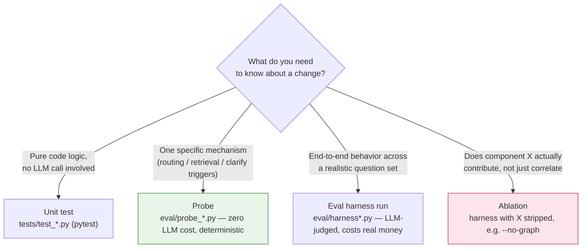

# 05 · Evaluation

**What you'll build**: the judgment to reach for the right one of four
measurement tools this project uses — unit test, probe, eval harness run,
or ablation — instead of defaulting to "just run the eval set" for
questions it structurally cannot answer (§5.3 has a documented case where
that default produced a false negative). By the end you'll have run at
least one of each.

Covers `eval/harness.py`, `eval/harness_tier3.py`, `eval/harness_router.py`,
five `eval/probe_*.py` modules, and `data/datasets/*.json` — six sets, listed
below (an earlier draft of this handbook's own mapping missed two of them —
check the directory directly rather than trusting any fixed list, including
this one, past the date it was written).

## 5.0 Which measurement tool, when

Four tools, each answering a different question about a change — reaching
for the wrong one either wastes money (an eval harness run where a probe
would do) or hides the real answer (an eval harness run where the true
effect is narrower than the metric's own noise band, §5.3):



The probe branch exists *because* the harness branch has real limits: this
project's own multi-turn metric has a noise band wide enough to swallow
most real improvements (§5.3), so a probe isolates the specific
mechanism deterministically instead of gambling on one LLM-judged run.
Ablations have the same problem one level up — §5.5's multi-turn example
needed five repeated runs before the true effect separated from noise at
all, which is why `--repeat N` exists as an ablation option, not a
probe-level one.

## 5.1 The eval sets

Counts below were read directly from each file, not carried over from an
older note:

| Set | Items | What it tests |
|---|---:|---|
| `eval_set.json` (v1.4) | 33 (3 retired) | The frozen core regression set — Tier-1 direct lookup, Tier-2 multi-step (margins/YoY), retrieval passage-hit, refusal correctness |
| `eval_set_tier3.json` (v1.0) | 8 | Cross-company graph reasoning (`graph_query`) — the questions ch.05 §5.5's ablation is run against |
| `eval_set_v2.json` (v2.1) | 13 (2 held-out) | A designed second-generation set — hard numeric edge cases (near-zero CAGR, negative margins), a unit trap, synonym-stress pairs, an over-refusal probe, and a grounded-scoring item that scores by outcome rather than by which tool was used |
| `eval_set_router.json` (v1.0) | 12 | Deterministic tool-routing probe questions |
| `eval_set_defects.json` (v1.0) | 6 | One question per confirmed historical defect — each item exists *because* the system once failed on it, not because it fits a coverage template |
| `eval_set_multiturn.json` | 5 conversations, 11 turns (9 scored) | Follow-up questions that require carrying context (company, fiscal year) across turns |

**The retirement mechanism (`eval_set.json`) is itself a teaching point.** A
frozen set protects against tuning to the test — but it cannot stop a
question's *premise* from becoming false as the underlying database changes
(a question written assuming a specific fiscal year's disclosure wording,
where that wording later changed in a newer filing). Retiring a specific
item, with a recorded reason, resolves that tension without reopening the
freeze to arbitrary edits — the difference between "we changed a question
because a model got it wrong" (forbidden) and "we retired a question because
its premise stopped being true" (a data-integrity fix, logged).

## 5.2 How the harness scores an answer

`harness.py`'s core scoring rules, applied consistently across all sets:

- **Numeric tolerance** is SI-scale-aware (a stated "$1.2B" matches an
  expected `1200000000`) plus a separate absolute-tolerance mode
  (`tolerance_abs`) for cases where SI-scale matching would defeat the
  point of the check — a near-zero expected value, or a deliberate
  unit-trap question where the whole test is whether the model picks the
  right magnitude.
- **Input-value checking** (Tier-2 questions) verifies the agent fetched the
  *correct raw inputs* before computing, not just that the final number
  happens to match — catching a right-answer-wrong-reasoning case a
  final-number-only check would miss.
- **The `grounded` scoring type scores by outcome, not by which tool
  produced it** — a question can be answered correctly through more than
  one tool path, and this scoring type credits the answer regardless of
  which one produced it.
- **The retrieval passage-hit check credits evidence from both
  `retrieve_text` chunks and `graph_query` edges' `source_text`** — either
  is a valid source for the same underlying disclosure sentence.

## 5.3 Zero-cost deterministic probes

The strongest methodological content in this project. An LLM-judged eval
run cannot always distinguish "this change helped" from "this run got
lucky." The five `eval/probe_*.py` modules exist to isolate a specific
mechanism deterministically, at zero LLM cost, when
the eval set itself lacks the resolution to:

| Probe | Isolates |
|---|---|
| `probe_router.py` | Tool-routing decisions against known-direction test phrasings (§4.3's 38.9%-vs-100% finding was measured here, not in the LLM-judged harness) |
| `probe_retrieval.py` / `probe_truncation.py` | Whether a specific chunk actually reaches the top-k window — chunking and embedding-truncation defects, independent of what the agent does with a chunk once retrieved |
| `probe_year_scope.py` | Whether year-scoped retrieval (§3.3) actually narrows results to the right filing |
| `probe_clarify.py` | Whether `clarify.py` fires exactly on its intended trigger set and nowhere else |

The throughline for extending this project: when a change's effect is
smaller than the relevant metric's noise band, don't trust a single LLM-
judged run either direction — build or reuse a deterministic probe that
isolates the specific mechanism instead.

## 5.4 Running an evaluation and reading the result

```bash
PYTHONUTF8=1 uv run --active python -m copilot.eval.harness --out data/results/eval_results_<name>.json
```

Every result file records a `db_fingerprint` (row counts across the core
tables at run time) alongside the scores.

> **Before comparing two result files, compare their fingerprints first** —
> a score delta measured across two different database states is not a
> valid before/after comparison, and nothing else in the file will tell you
> this happened unless you check.
See Appendix B for the current expected-value table.

## 5.5 Ablations

- **`harness_tier3.py --no-graph`** strips the `graph_query` tool from the
  agent's schema entirely, isolating what the supply-chain graph layer
  itself contributes versus a naive-RAG baseline on the same 8 cross-company
  questions: **graph-augmented 100% (8/8) vs. baseline 12.5% (1/8) —
  +87.5pp.**
- **`harness_router.py` before/after** compares tool-selection outcomes and
  cost with the deterministic router (§4.3) enabled versus disabled.
- **Multi-turn `--repeat N` / `--no-inherit`** — the multi-turn set's own
  effect (does context-carrying actually help, §4.4) was *not* visible in a
  single run: a first before/after comparison at n=1 showed the *disabled*
  arm scoring higher by chance. Only after `--repeat 5` (five independent
  runs per arm) did the real effect separate from noise — a concrete,
  measured instance of exactly the problem §5.3 exists to solve, and the
  reason a multi-turn evaluation claim in this project is never made from a
  single run.

## Checkpoint

Run one of each of the four tools from §5.0, cheapest first:

```bash
# 1. Unit tests (no LLM, seconds)
uv run --active pytest tests/ -q

# 2. A probe (no LLM, deterministic)
uv run --active python -m copilot.eval.probe_router --out /tmp/probe_router.json

# 3. An eval harness run (LLM-judged, ~$0.03, ~2 min — see Appendix C)
PYTHONUTF8=1 uv run --active python -m copilot.eval.harness --out /tmp/eval.json

# 4. An ablation (LLM-judged, isolates the graph layer's own contribution)
uv run --active python -m copilot.eval.harness_tier3 --no-graph --out /tmp/no_graph.json
```

**Pass criteria**: (1) all pass, (2) 20/20, (3) matches Appendix B's numbers
(numeric/refusal/retrieval all 100%), (4) noticeably worse
than the graph-augmented default — a *low* score here is what "pass" looks
like, since the point of this specific ablation is to confirm the baseline
is genuinely weaker without the graph layer, not that it's good.
